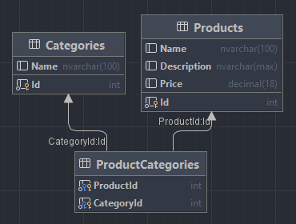
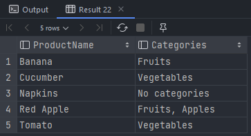

# Тестовое задание MindBox

Выполнил Жидков Георгий

### Задание 1

Библиотека для поставки внешним клиентам, которая умеет вычислять площадь круга по радиусу и треугольника по трем сторонам.

Реализация библиотеки:

- [FigureBase.cs](GeometryLibrary/FigureBase.cs) - Базовый класс фигур
- [AreaCalculator.cs](GeometryLibrary/AreaCalculator.cs) - Статический класс для вычисления площади неизвестной фигуры в compile-time
- [Figures/](GeometryLibrary/Figures/) - Реализации встроенных в библиотеку фигур

Реализация тестов:
- [Tests.AreaCalculator](GeometryLibrary.Tests/AreaCalculator) - Тесты для статического класса подсчета площади фигуры
- [Tests.Figures](GeometryLibrary.Tests/Figures) - Тесты для встроенных в библиотеку фигур

### Задание 2

Запрос к базе данных MS SQL Server

Реализация:

- [task2.sql](/task2.sql) - Запрос к базе данных для выбора всех пар «Имя продукта – Имя категории».

Также создал тестовую базу данных для проверки запроса:

- [test_tables.sql](/test_tables.sql) - Создание тестовой базы данных и таблиц

Схема тестовой БД:

Результат выполнения запроса в тестовой БД:

